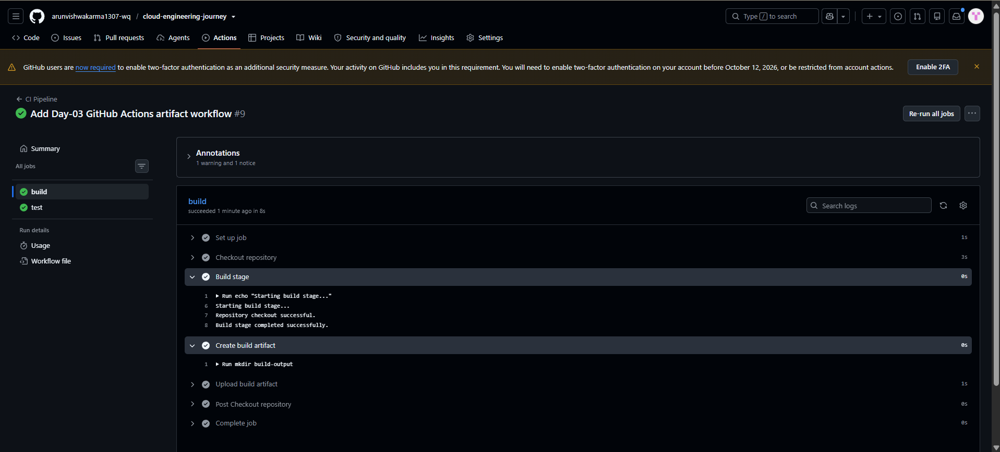
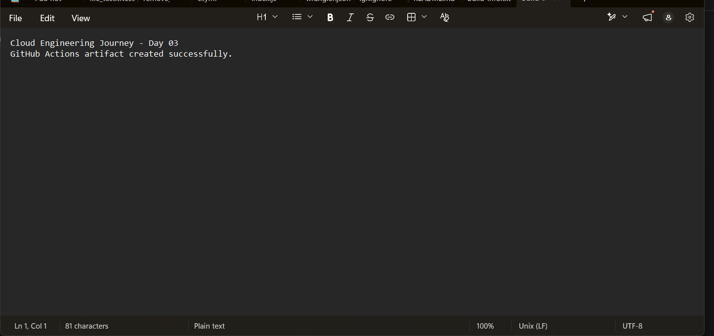

# Day 03 - GitHub Actions Artifacts

## Objective

In this practical, I learned how to create, upload, store, and download build artifacts using GitHub Actions.

The workflow creates a build output file during the CI process and uploads it as a GitHub Actions artifact.

---

## GitHub Actions Artifact

An artifact is a file or folder generated during a GitHub Actions workflow that can be stored with the workflow run and downloaded later.

In this practical, the workflow created:

```text
build-output/
└── build-info.txt
```

The file contains:

```text
Cloud Engineering Journey - Day 03
GitHub Actions artifact created successfully.
```

---

## Workflow Process

The CI workflow performs these steps:

```text
GitHub Push
    ↓
Build Job
    ↓
Create build-output/
    ↓
Create build-info.txt
    ↓
Upload Artifact
    ↓
GitHub Actions stores Artifact
    ↓
Artifact Download
    ↓
Verify build-info.txt
```

---

## Create Build Artifact

The workflow creates a `build-output` directory and generates the `build-info.txt` file.

The generated file is then uploaded using:

```yaml
uses: actions/upload-artifact@v4
```

The artifact name used in this practical was:

```text
day-03-build-artifact
```

---

## Successful Artifact Upload

The GitHub Actions workflow completed successfully.

The `build` job successfully executed:

- Build stage
- Create build artifact
- Upload build artifact

The `test` job also completed successfully.

**Screenshot:**



**File name:** `01-artifact-upload-success.png`

---

## Artifact Download and Verification

After the workflow completed, the generated artifact was downloaded from the GitHub Actions run.

The downloaded artifact contained:

```text
build-output/
└── build-info.txt
```

The contents of `build-info.txt` were successfully verified:

```text
Cloud Engineering Journey - Day 03
GitHub Actions artifact created successfully.
```

**Screenshot:**



**File name:** `02-downloaded-artifact-verification.png`

---

## Practical Result

The complete artifact workflow was successfully tested:

```text
Build → Create File → Upload Artifact → Download Artifact → Verify File
```

The artifact was successfully stored by GitHub Actions and downloaded for verification.

---

## What I Learned

- GitHub Actions Artifacts
- Creating build output files
- `actions/upload-artifact@v4`
- Artifact naming
- Uploading build output
- Downloading workflow artifacts
- Verifying downloaded artifacts
- Preserving workflow-generated files

---

## Final Result

Successfully implemented and verified a GitHub Actions artifact workflow.

The workflow can generate a build output, upload it to GitHub Actions, and allow the generated artifact to be downloaded after the workflow completes.# Day 03 - GitHub Actions Artifacts

