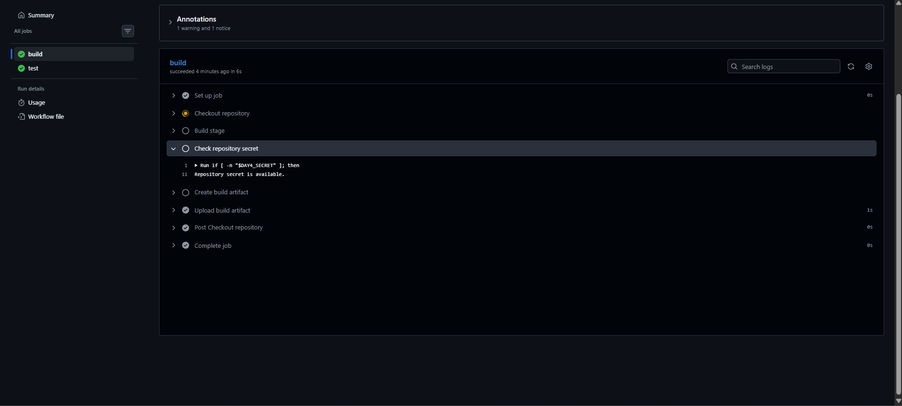
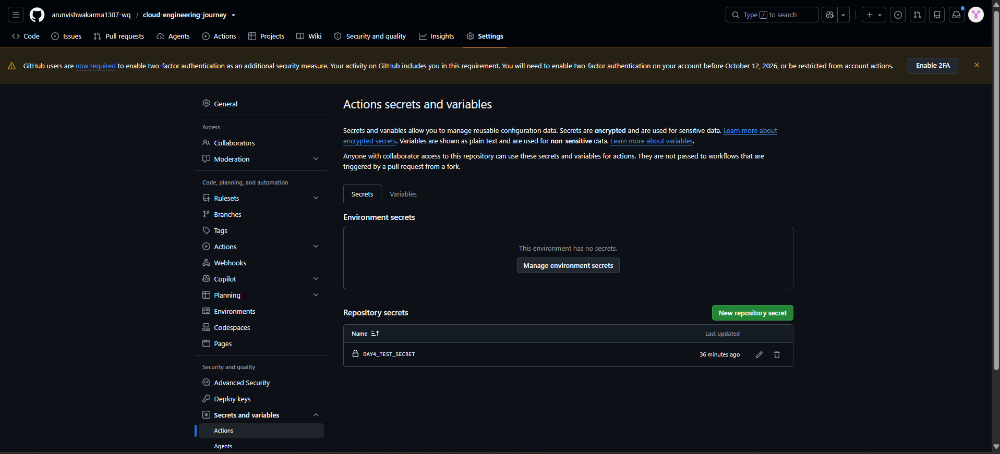

# Day 04 - GitHub Actions Secrets & Secure Variables

## Objective

In this practical, I learned how to create a GitHub repository secret and securely use it inside a GitHub Actions workflow without exposing its actual value in the workflow logs.

---

## 1. Repository Secret Created

Created a repository secret from:

**GitHub Repository → Settings → Secrets and variables → Actions**

Secret name:

```text
DAY4_TEST_SECRET
```

The secret value was stored securely in GitHub and was not written directly inside the workflow file.

### Screenshot



---

## 2. Secret Used in GitHub Actions

The workflow accessed the repository secret using the GitHub Actions `secrets` context:

```yaml
env:
  DAY4_SECRET: ${{ secrets.DAY4_TEST_SECRET }}
```

The workflow checked whether the secret was available without printing its actual value:

```bash
if [ -n "$DAY4_SECRET" ]; then
  echo "Repository secret is available."
else
  echo "Repository secret is not available."
  exit 1
fi
```

---

## 3. GitHub Actions Verification

After pushing the workflow to GitHub, the Actions workflow completed successfully.

The `Check repository secret` step confirmed:

```text
Repository secret is available.
```

The actual secret value was never displayed in the workflow logs.

### Screenshot



---

## 4. Workflow Result

The Day-04 GitHub Actions workflow completed successfully:

```text
Build                   ✅
Check repository secret ✅
Create build artifact   ✅
Upload build artifact   ✅
Test                    ✅
```

The practical successfully demonstrated secure usage of a GitHub repository secret inside GitHub Actions.

---

## What I Practiced

- Creating a GitHub repository secret
- Using repository secrets in GitHub Actions
- Passing a secret through an environment variable
- Checking secret availability without exposing its value
- Running and verifying a GitHub Actions workflow
- Keeping sensitive values out of workflow files and logs