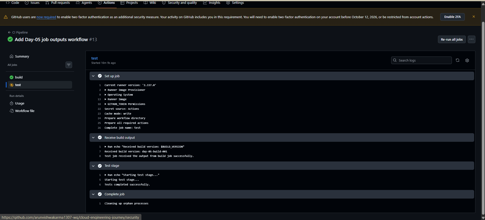
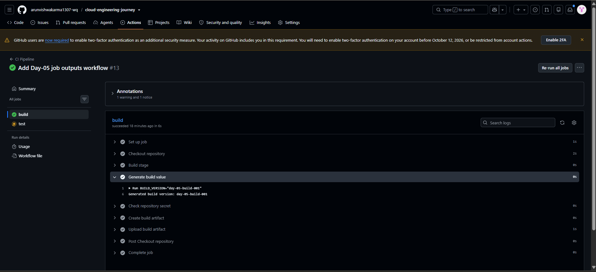
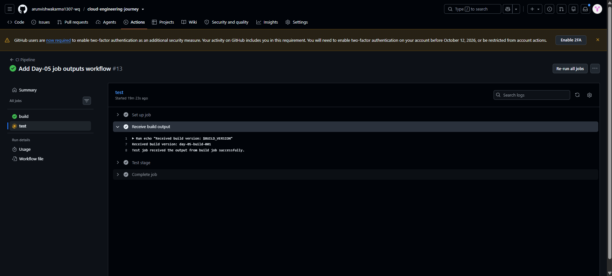

# Day-05 — GitHub Actions Job Outputs & Data Passing Between Jobs

## Overview

In Day-05, I learned how to generate a value inside one GitHub Actions job and pass that value to another job using Job Outputs.

The practical was implemented in the existing GitHub Actions workflow:

`.github/workflows/ci.yml`

The workflow used a `build` job and a dependent `test` job.

## What I Practiced

- Generating a value inside a GitHub Actions step
- Using a step `id`
- Using `GITHUB_OUTPUT`
- Defining Job Outputs
- Using `needs` between jobs
- Passing data from the `build` job to the `test` job
- Receiving and displaying the passed value in the `test` job

## Practical Flow

Build Job
↓
Generate build value
↓
GITHUB_OUTPUT
↓
Job Output
↓
Test Job
↓
Receive and use the output

## Implementation

The `build` job generated the following value:

`day-05-build-001`

The value was written to `GITHUB_OUTPUT` using:

`echo "BUILD_VERSION=$BUILD_VERSION" >> "$GITHUB_OUTPUT"`

The step was given an ID:

`id: generate-value`

The value was then exposed as a Job Output:

`outputs:
  build-version: ${{ steps.generate-value.outputs.BUILD_VERSION }}`

The `test` job depended on the `build` job:

`needs: build`

The output was received using:

`BUILD_VERSION: ${{ needs.build.outputs.build-version }}`

The workflow successfully displayed:

`Received build version: day-05-build-001`

This confirmed that the value generated in the `build` job was successfully passed to the `test` job.

## GitHub Actions Result

The workflow completed successfully.

The `build` job successfully generated the build value, and the `test` job successfully received the same value from the Job Output.

## Screenshots

### 1. Overall Workflow Success

### 2. Build Value Generated

### 3. Job Output Received

## Final Result

Day-05 successfully demonstrated data passing between GitHub Actions jobs using Job Outputs.

The `build` job generated `day-05-build-001`, exposed it as a Job Output, and the dependent `test` job successfully received and displayed the same value.

## Day-05 Status

✅ Job Outputs practiced  
✅ `GITHUB_OUTPUT` practiced  
✅ Step ID practiced  
✅ `needs` dependency used  
✅ Data passed between jobs  
✅ GitHub Actions workflow completed successfully