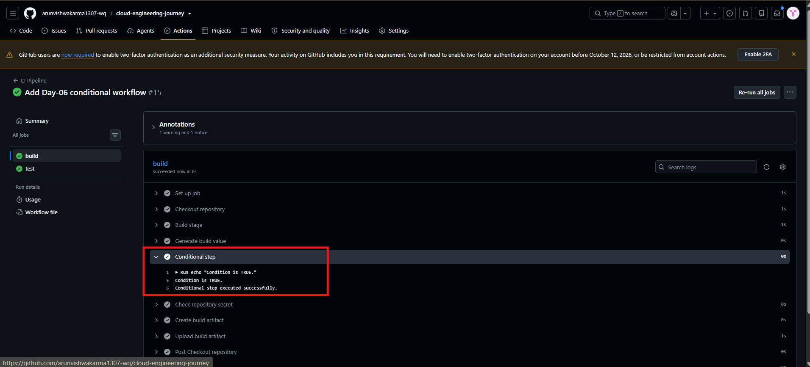
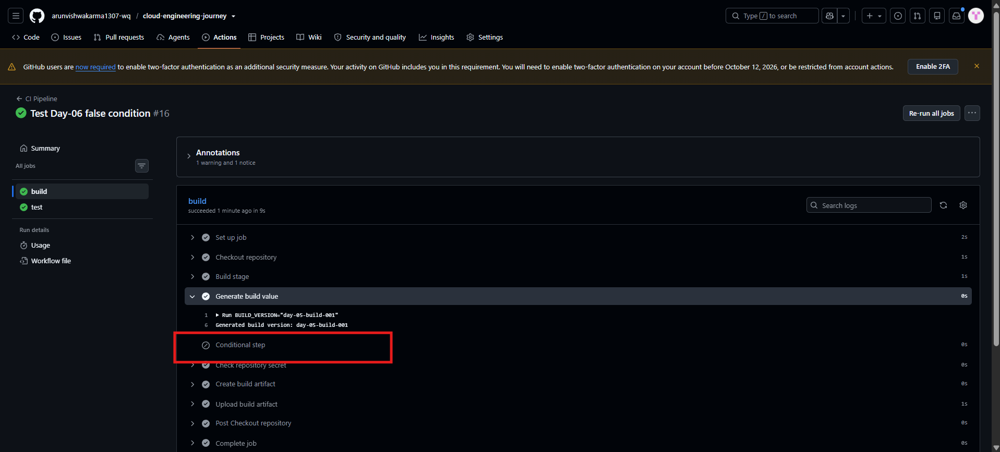

# Day-06 — GitHub Actions Job Conditions & if

## Overview

In Day-06, I learned how to control the execution of a GitHub Actions step using an `if` condition.

The practical was implemented in the existing `.github/workflows/ci.yml`.

The workflow tested both cases:

- Condition TRUE → Step executed
- Condition FALSE → Step skipped

## What I Practiced

- GitHub Actions `if` condition
- Conditional step execution
- Comparing a generated output value
- TRUE condition behavior
- FALSE condition behavior
- Skipped step behavior
- Testing conditional workflow execution

## Practical Flow

Build Job
↓
Generate Build Value
↓
Check Condition
↓
TRUE → Conditional Step Runs
↓
FALSE → Conditional Step Is Skipped

## TRUE Condition Test

The generated build value was:

`day-05-build-001`

The conditional step checked whether the generated value matched:

`day-05-build-001`

When the condition was TRUE, the workflow displayed:

`Condition is TRUE.`

and:

`Conditional step executed successfully.`

## FALSE Condition Test

For the FALSE condition test, the workflow temporarily checked for:

`day-06-build-001`

The actual generated value was still:

`day-05-build-001`

Because the values did not match, the conditional step was skipped.

The remaining workflow continued successfully.

## GitHub Actions Result

### TRUE Condition

The conditional step executed successfully when the condition matched the generated value.

### FALSE Condition

The conditional step was skipped when the condition did not match the generated value.

Both cases were successfully tested in GitHub Actions.

## Screenshots

### 1. Conditional Step — TRUE

Shows the conditional step executing successfully when the condition is TRUE.

### 2. Conditional Step — FALSE / Skipped

Shows the conditional step being skipped when the condition is FALSE.

## Final Result

Day-06 successfully demonstrated conditional execution in GitHub Actions using the `if` condition.

The TRUE condition caused the step to execute, while the FALSE condition caused the step to be skipped.

After testing the FALSE condition, the workflow was restored to the TRUE condition and the final workflow was pushed to GitHub.

## Day-06 Status

✅ `if` condition practiced  
✅ TRUE condition tested  
✅ Conditional step executed  
✅ FALSE condition tested  
✅ Conditional step skipped  
✅ Workflow continued successfully  
✅ Final workflow restored to TRUE condition  
✅ Changes pushed to GitHub