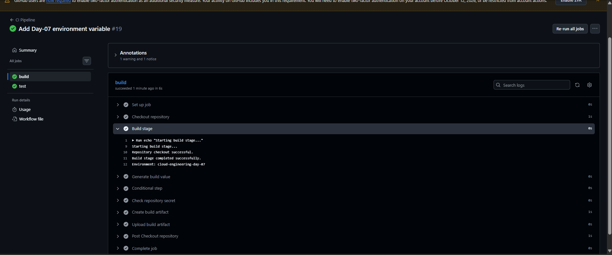

# Day-07 — GitHub Actions Environment Variables

## Overview

In Day-07, I practiced using environment variables in GitHub Actions.

I created a workflow-level environment variable and used it inside the build job to make the value available during workflow execution.

## What I Practiced

- GitHub Actions environment variables
- Workflow-level `env`
- Using environment variables inside a job step
- Accessing an environment variable with `$DAY7_ENV`
- Verifying the variable value in GitHub Actions logs
- Keeping the existing Day-01 to Day-06 CI pipeline functionality

## Practical Flow

1. Added a workflow-level environment variable:

```yaml
env:
  DAY7_ENV: "cloud-engineering-day-07"
```

2. Used the environment variable inside the Build stage:

```bash
echo "Environment: $DAY7_ENV"
```

3. Pushed the updated workflow to GitHub.

4. GitHub Actions executed the workflow successfully.

5. The workflow log displayed:

```text
Environment: cloud-engineering-day-07
```

## Implementation

The environment variable was defined at the workflow level, so it was available to the workflow jobs.

The Build stage accessed the variable using:

```bash
$DAY7_ENV
```

This demonstrated how a value defined through `env` can be used during a GitHub Actions step.

## GitHub Actions Result

The workflow completed successfully.

- `build` job: Successful
- `test` job: Successful
- Environment variable value displayed correctly
- Existing conditional step continued to work

## Screenshot

### Environment Variable Success



The screenshot shows the successful GitHub Actions run and the environment variable value displayed during the Build stage.

## Final Result

Day-07 successfully demonstrated the use of a workflow-level environment variable in GitHub Actions.

The variable `DAY7_ENV` was created with the value:

```text
cloud-engineering-day-07
```

The value was successfully accessed and displayed inside the Build stage.

## Status

**Day-07 Completed Successfully** ✅