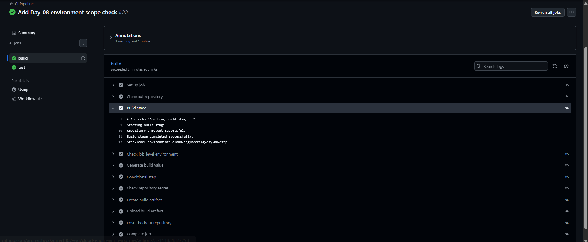
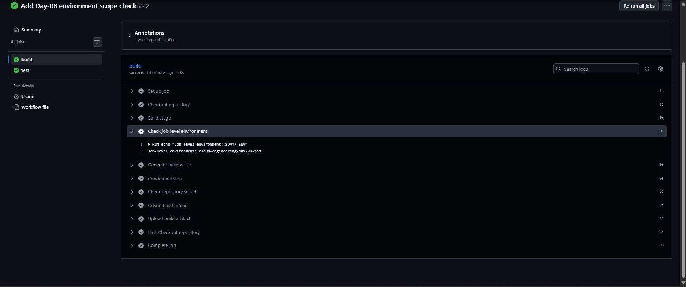

# Day-08 — GitHub Actions Environment Variable Scope

## Overview

Day-08 focused on understanding how environment variables work at different scopes in GitHub Actions.

In this practical, the same environment variable was defined at:

- Workflow level
- Job level
- Step level

The practical also verified that a more specific scope overrides the value inherited from a broader scope.

## What I Practiced

- Workflow-level environment variables
- Job-level environment variables
- Step-level environment variables
- Environment variable scope and override behavior
- Verifying environment variable values through GitHub Actions logs

## Practical Flow

The existing `DAY7_ENV` environment variable from Day-07 was used to demonstrate scope and override behavior.

### Workflow-level value

The workflow-level value was:

    env:
      DAY7_ENV: "cloud-engineering-day-07"

### Job-level value

The `build` job overrides the workflow-level value:

    jobs:
      build:
        env:
          DAY7_ENV: "cloud-engineering-day-08-job"

### Step-level value

The `Build stage` step overrides the job-level value:

    - name: Build stage
      env:
        DAY7_ENV: "cloud-engineering-day-08-step"

### Job-level verification

A separate step without its own `env` value was added:

    - name: Check job-level environment
      run: |
        echo "Job-level environment: $DAY7_ENV"

This verified that the job-level value is available to the step when no step-level override is present.

## Verification

GitHub Actions successfully executed the workflow.

### Step-level environment

The `Build stage` log showed:

    Step-level environment: cloud-engineering-day-08-step

This confirmed that the step-level value overrides the job-level value.

Screenshot:

### Job-level environment

The `Check job-level environment` log showed:

    Job-level environment: cloud-engineering-day-08-job

This confirmed that the job-level value is used when the step does not define its own value.

Screenshot:

## Environment Variable Scope

The practical demonstrated the following scope:

    Workflow-level
          ↓
    Job-level override
          ↓
    Step-level override

A more specific scope can override the value inherited from a broader scope.

## Final Result

- Workflow-level environment variable configured successfully.
- Job-level environment variable override verified successfully.
- Step-level environment variable override verified successfully.
- Both environment values were confirmed through GitHub Actions logs.
- GitHub Actions `build` and `test` jobs completed successfully.

## Status

**Day-08 Completed Successfully ✅**