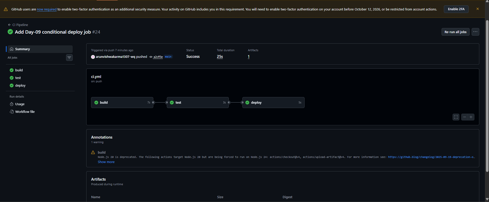
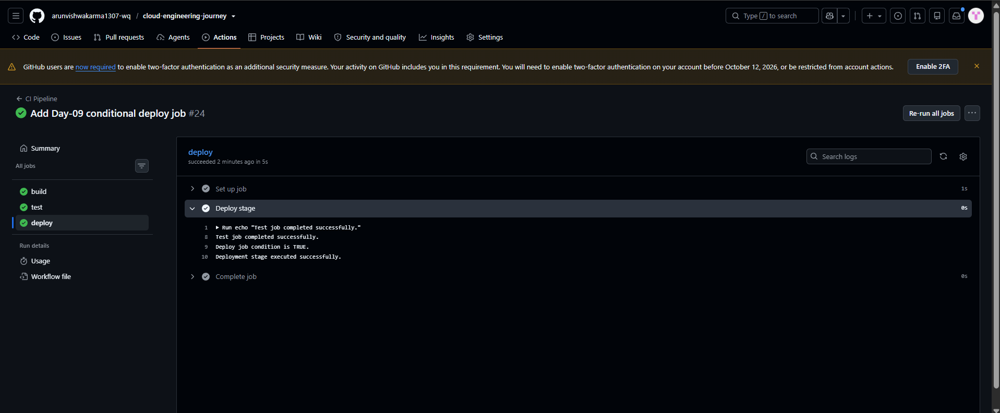

# Day-09 — GitHub Actions Conditional Job Execution

## Overview

Day-09 focused on controlling the execution of a GitHub Actions job based on the result of another job.

A new `deploy` job was added after the existing `build` and `test` jobs.

The workflow was configured so that the `deploy` job runs only after the `test` job completes successfully.

## What I Practiced

- Job dependencies using `needs`
- Conditional job execution using `if`
- Build → Test → Deploy workflow flow
- Verifying job execution through GitHub Actions
- Checking successful conditional deployment execution

## Practical Flow

The workflow was configured with the following job sequence:

    build
      ↓
    test
      ↓
    deploy

The `deploy` job was configured as:

    deploy:
      needs: test
      if: ${{ success() }}

The `needs: test` setting makes the `deploy` job depend on the `test` job.

The `if: ${{ success() }}` condition allows the deploy job to execute when the required previous job completes successfully.

## Deployment Stage

The `deploy` job contains a deployment stage that prints verification messages:

    - name: Deploy stage
      run: |
        echo "Test job completed successfully."
        echo "Deploy job condition is TRUE."
        echo "Deployment stage executed successfully."

## Verification

The GitHub Actions workflow completed successfully.

The following jobs were successfully executed:

- `build` ✅
- `test` ✅
- `deploy` ✅

Screenshot:



The deploy job output confirmed:

    Test job completed successfully.
    Deploy job condition is TRUE.
    Deployment stage executed successfully.

Screenshot:



## Result

The practical successfully demonstrated that the `deploy` job runs after the `test` job and executes when the required condition is successful.

The final workflow flow was:

    Build → Test → Deploy

## Status

**Day-09 Completed Successfully ✅**
```

Available next action: :contentReference[oaicite:0]{index=0}