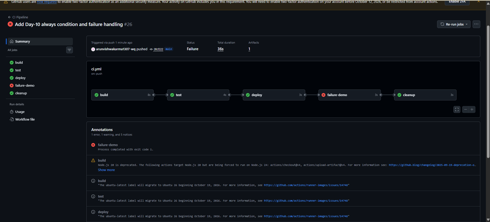
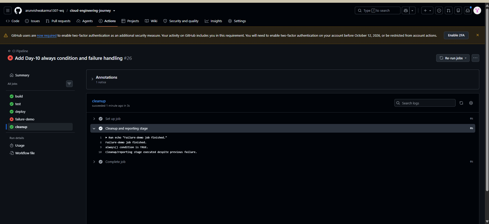

# CI/CD Day-10 — GitHub Actions `always()` Condition and Failure Handling

## Objective

Understand how GitHub Actions handles a failed job and how the `always()` condition allows a dependent job to run even when the previous job fails.

## What I Practiced

- Added an intentional failure job named `failure-demo`.
- Used `exit 1` to create an actual job failure.
- Added a `cleanup` job that depends on `failure-demo`.
- Used `if: ${{ always() }}` in the `cleanup` job.
- Verified that `cleanup` still executes even though `failure-demo` fails.
- Verified the result directly in GitHub Actions logs.

## Workflow Flow

The workflow executed in this order:

`build → test → deploy → failure-demo → cleanup`

Result:

- `build` — Success
- `test` — Success
- `deploy` — Success
- `failure-demo` — Failed intentionally
- `cleanup` — Success because of `always()`

## Intentional Failure

The `failure-demo` job contains:

    echo "Starting intentional failure demonstration..."
    echo "This job will fail for Day-10 testing."
    exit 1

The `exit 1` command intentionally makes the job fail.

## `always()` Demonstration

The `cleanup` job uses:

    needs: failure-demo
    if: ${{ always() }}

Because of `always()`, the cleanup/reporting job runs even after the previous job fails.

The GitHub Actions log confirmed:

    Failure-demo job finished.
    always() condition is TRUE.
    Cleanup/reporting stage executed despite previous failure.

## Actual Result

The GitHub Actions workflow was marked as **Failure** because `failure-demo` intentionally failed.

However, the `cleanup` job successfully executed after the failure.

This confirmed the practical behavior of the `always()` condition.

## Screenshots

### 1. Overall Workflow Result

Shows the complete workflow with successful `build`, `test`, and `deploy` jobs, the intentional failure of `failure-demo`, and successful execution of `cleanup`.

### 2. `always()` Cleanup Execution

Shows the actual `cleanup` job logs proving that the job executed despite the previous failure.

## Day-10 Outcome

Successfully demonstrated GitHub Actions failure handling and verified that a dependent job using `if: ${{ always() }}` can execute even when the previous job fails.