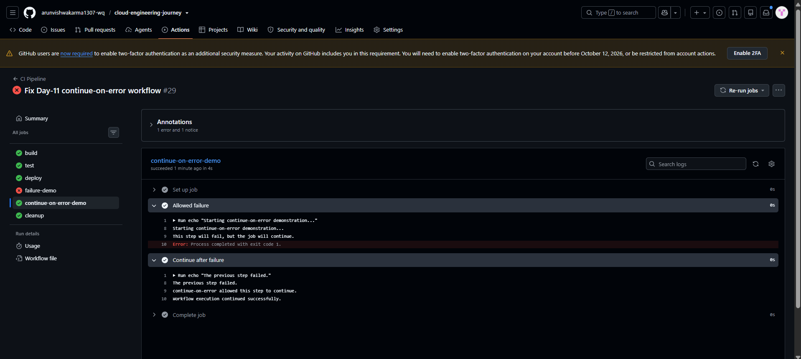
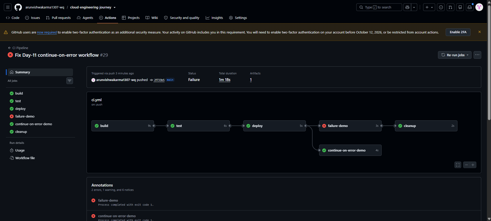

# CI/CD Day-11 — GitHub Actions Continue-on-Error

## Objective

Understand how GitHub Actions `continue-on-error` allows workflow execution to continue even when a step fails.

## Practical Work

A `continue-on-error-demo` job was added to the CI Pipeline.

The job contains two steps:

1. **Allowed failure**
   - The step intentionally fails using `exit 1`.
   - `continue-on-error: true` is applied to the step.

2. **Continue after failure**
   - Runs after the previous step fails.
   - Confirms that workflow execution continues successfully.

The relevant configuration used was:

```yaml
continue-on-error: true
```

The `continue-on-error-demo` job was configured to run after the successful `deploy` job.

## Workflow Flow

```text
build
  ↓
test
  ↓
deploy
  ↓
continue-on-error-demo
      ├── Allowed failure ❌
      ↓
  Continue after failure ✅
```

The existing Day-10 `failure-demo` and `cleanup` jobs were also present in the workflow.

## Test Result

The `Allowed failure` step intentionally failed with exit code 1.

Because `continue-on-error: true` was used, the next step continued running successfully.

The GitHub Actions log showed:

```text
The previous step failed.
continue-on-error allowed this step to continue.
Workflow execution continued successfully.
```

The `continue-on-error-demo` job completed successfully.

## Screenshots

### 1. Continue-on-Error Step Result



### 2. Day-11 Workflow Summary



## Final Result

Day-11 successfully demonstrated GitHub Actions `continue-on-error`.

The intentionally failing step did not stop the job, and the next step executed successfully.