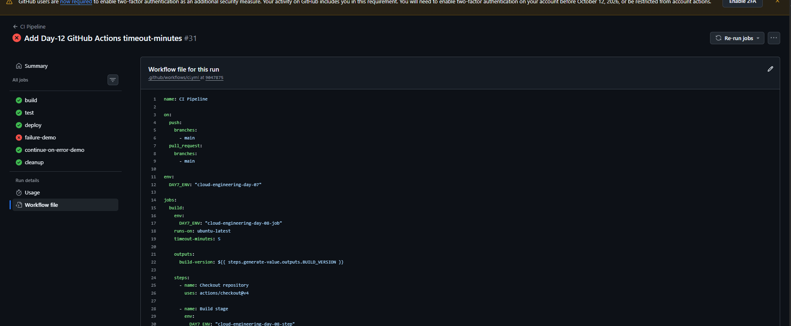
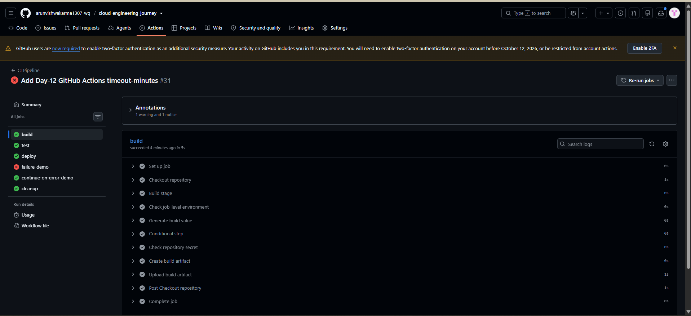
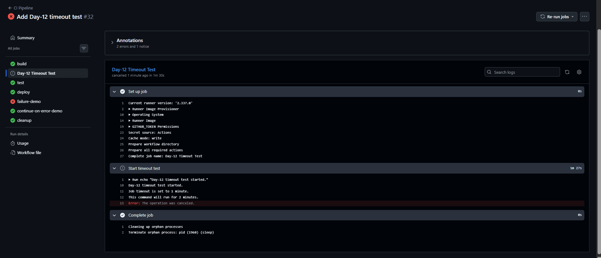

# Day-12: GitHub Actions Job Timeout

## Objective

To learn how to set a time limit for a GitHub Actions job using `timeout-minutes` and verify its behavior with a controlled timeout test.

## Tools Used

- GitHub Actions
- GitHub repository
- GitHub Actions YAML workflow
- PowerShell
- Git

## Practical Implementation

### 1. Configure Job Timeout

Updated the existing GitHub Actions workflow file:

`.github/workflows/ci.yml`

Added `timeout-minutes: 5` to the `build` job.

```yaml
build:
  runs-on: ubuntu-latest
  timeout-minutes: 5
```

This configuration sets a five-minute execution limit for the build job.

### 2. Create a Timeout Test Job

Added a separate job named `Day-12 Timeout Test` to the workflow.

```yaml
timeout-demo:
  name: Day-12 Timeout Test
  runs-on: ubuntu-latest
  timeout-minutes: 1

  steps:
    - name: Start timeout test
      run: |
        echo "Day-12 timeout test started."
        echo "Job timeout is set to 1 minute."
        echo "This command will run for 2 minutes."
        sleep 120
        echo "This line should not be reached."
```

The job was configured with a one-minute timeout, while the `sleep 120` command was designed to run for two minutes.

This allowed the timeout behavior to be tested without deliberately slowing down the existing build, test, or deployment jobs.

### 3. Push Changes to GitHub

Committed and pushed the workflow changes to the GitHub repository.

GitHub Actions automatically ran the updated workflow after the push.

### 4. Verify the Workflow Execution

Opened the latest workflow run and checked the job results.

The following results were observed:

- **Build:** Successful.
- **Test:** Successful.
- **Deploy:** Successful.
- **Continue-on-error demo:** Successful.
- **Cleanup:** Successful.
- **Failure demo:** Failed as intentionally configured.
- **Day-12 Timeout Test:** Cancelled after approximately 1 minute and 30 seconds at the job level.

The timeout test logs displayed:

```text
Day-12 timeout test started.
Job timeout is set to 1 minute.
This command will run for 2 minutes.
Error: The operation was canceled.
```

The runner also terminated the `sleep` process during job cleanup. The final message, `This line should not be reached.`, was not executed.

## Screenshots

### 1. Timeout Configuration



Shows the `timeout-minutes: 5` setting in the build job.

### 2. Build Job Success



Shows the successful execution of the build job with the timeout configuration.

### 3. Timeout Test Result



Shows the timeout test being cancelled and the sleep process being terminated.

## Final Result

Successfully configured a five-minute timeout for the build job and demonstrated timeout behavior using a separate job with a one-minute limit.

The two-minute sleep command was cancelled before completion, confirming that the configured timeout was enforced.

The overall workflow run was not fully successful because the existing `failure-demo` job intentionally fails and the timeout test is intentionally cancelled.

## Key Learning

- How to configure `timeout-minutes` for an individual GitHub Actions job.
- How to test timeout behavior using a controlled long-running command.
- How to inspect job logs and execution status in GitHub Actions.
- Why a workflow can contain both successful jobs and intentionally failed or cancelled jobs.