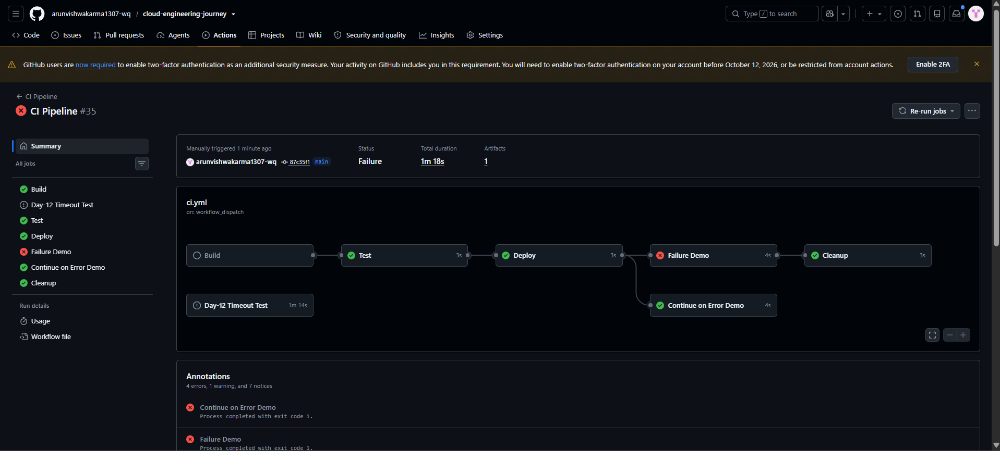
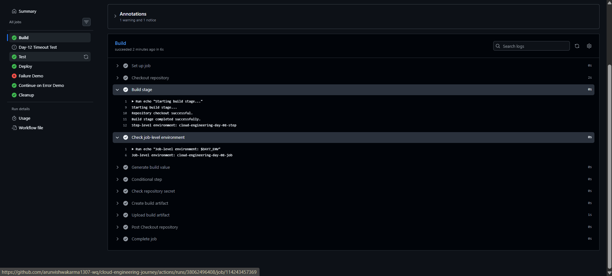

# Day-13: GitHub Actions Manual Workflow Trigger

## Objective

To learn how to run a GitHub Actions workflow manually using `workflow_dispatch`, without requiring a new push or pull request to trigger the workflow.

## Tools Used

- GitHub Actions
- GitHub repository
- YAML
- PowerShell
- Git

## Practical Implementation

### 1. Update the Workflow Configuration

Opened the existing workflow file:

`.github/workflows/ci.yml`

Added `workflow_dispatch` under the `on` section while preserving the existing triggers.

```yaml
on:
  workflow_dispatch:
  push:
    branches:
      - main
  pull_request:
    branches:
      - main
```

This configuration enables manual execution from the GitHub Actions interface while retaining the existing push and pull request triggers.

### 2. Save and Push the Changes

Saved the updated workflow file, checked the Git status, staged the modified workflow, and committed and pushed the changes to the `main` branch.

### 3. Run the Workflow Manually

Opened the repository's **Actions** tab and selected the **CI Pipeline** workflow.

Clicked **Run workflow**, selected the `main` branch, and confirmed the run.

### 4. Verify the Manual Trigger

The new workflow run displayed:

- `Manually triggered`
- `on: workflow_dispatch`

These messages confirmed that the workflow was started manually rather than by a push event.

### 5. Verify the Build Job

Opened the Build job and verified that it completed successfully.

The logs confirmed that the repository checkout and build stage completed successfully. The workflow also completed its existing artifact upload step.

The overall workflow run was marked as failed because the existing `Failure Demo` job intentionally exits with code `1`. The `Day-12 Timeout Test` was also cancelled because of its configured timeout. These existing behaviors are separate from the Day-13 manual trigger test.

## Screenshots

### 1. Manual Workflow Run



Shows the manually triggered workflow run and the `workflow_dispatch` event.

### 2. Build Job Success



Shows the successful Build job and its execution logs.

## Final Result

Successfully enabled and tested manual workflow execution using `workflow_dispatch`.

Verified that the workflow could be started from the GitHub Actions interface and that the Build job completed successfully.

## Key Learning

- What `workflow_dispatch` does.
- How to enable manual workflow execution.
- How to run a workflow from the GitHub Actions interface.
- How to identify the trigger type in a workflow run.
- How to inspect individual job results when the overall workflow fails.