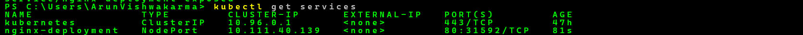
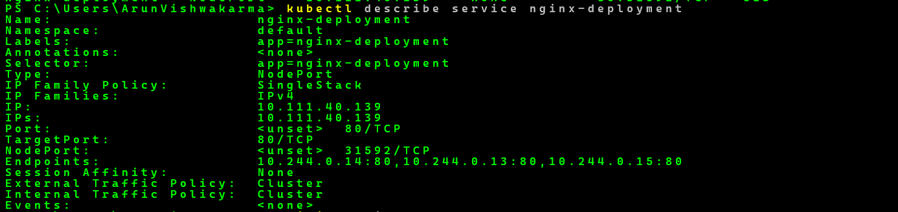
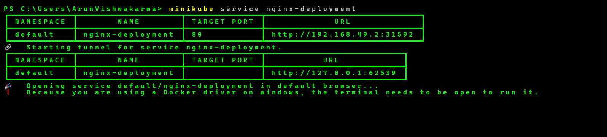
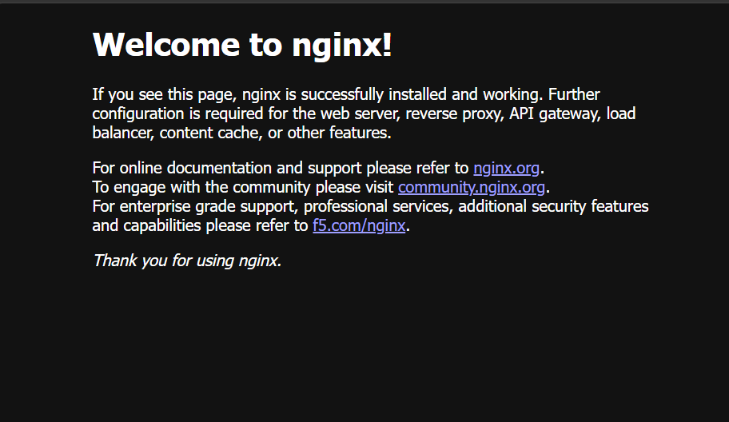
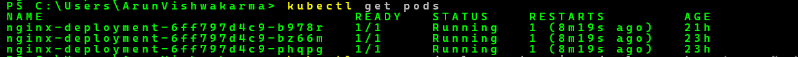

# Kubernetes Day 03 - Services (NodePort)

## Objective

Learn how Kubernetes Services provide a stable network endpoint to access Pods and expose applications outside the cluster using NodePort.

---

## Topics Covered

- What is a Service?
- Why do we need a Service?
- NodePort Service
- Exposing a Deployment
- Accessing an application in the browser
- Minikube Service

---

## Practical Performed

### 1. Checked Existing Deployment

```bash
kubectl get deployments
```

### 2. Checked Running Pods

```bash
kubectl get pods
```

### 3. Created a NodePort Service

```bash
kubectl expose deployment nginx-deployment --type=NodePort --port=80
```

### 4. Verified the Service

```bash
kubectl get services
```

### 5. Viewed Service Details

```bash
kubectl describe service nginx-deployment
```

### 6. Accessed the Application

```bash
minikube service nginx-deployment
```

Successfully opened the Nginx website in the browser.

---

## What I Learned

- A Service provides a stable network endpoint.
- Pods can change, but the Service remains the same.
- NodePort exposes an application outside the cluster.
- Minikube Service makes accessing applications easier on Windows.

---

## Result

Successfully created a NodePort Service and accessed the Nginx application through the browser.

## Screenshots

### Get Services



### Describe Service



### Minikube Service



### Nginx Website



### Running Pods

