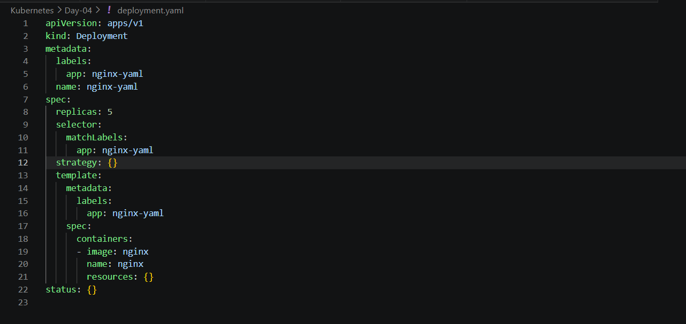
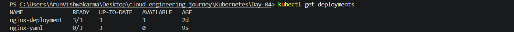
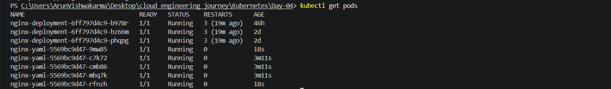

# Kubernetes Day 04 - Deployment using YAML (Declarative Approach)

## Objective

Learn how to create and manage Kubernetes Deployments using YAML files with the declarative approach.

---

## Topics Covered

- Imperative vs Declarative Approach
- Kubernetes YAML File
- Deployment YAML
- kubectl apply
- Updating Deployment using YAML

---

## Practical Performed

### 1. Generated Deployment YAML

```bash
kubectl create deployment nginx-yaml --image=nginx --dry-run=client -o yaml > deployment.yaml
```

### 2. Modified Deployment

Changed:

```yaml
replicas: 1
```

to

```yaml
replicas: 3
```

### 3. Applied the YAML File

```bash
kubectl apply -f deployment.yaml
```

### 4. Verified Deployment

```bash
kubectl get deployments
```

### 5. Verified Running Pods

```bash
kubectl get pods
```

### 6. Updated Deployment

Changed:

```yaml
replicas: 3
```

to

```yaml
replicas: 5
```

Applied again:

```bash
kubectl apply -f deployment.yaml
```

Verified Pods:

```bash
kubectl get pods
```

---

## What I Learned

- YAML is the standard way to manage Kubernetes resources.
- Declarative approach is preferred in real-world projects.
- kubectl apply updates existing resources.
- Changing replicas in YAML automatically updates Pods.

---

## Result

Successfully created and updated a Kubernetes Deployment using a YAML file.

## Screenshots

### Deployment YAML



### Apply YAML


### Get Deployments



### Get Pods

