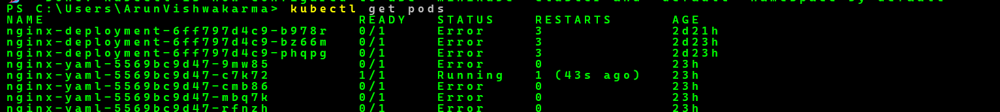
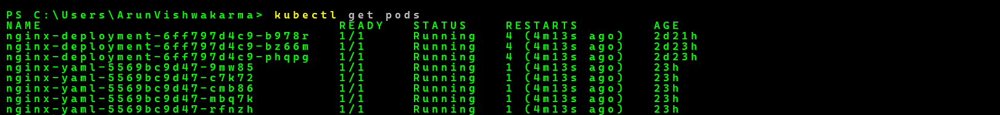
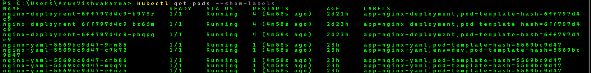
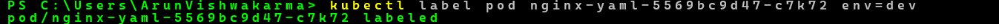

# Kubernetes Day 05 - Labels & Selectors

## Objective

Understand how Labels and Selectors work in Kubernetes for identifying and filtering resources.

---

## Topics Covered

- What are Labels in Kubernetes
- What are Selectors
- Adding Labels to Pods
- Filtering Pods using Labels

---

## Practical Performed

### 1. Checked Pods (Initial State)

```bash
kubectl get pods
```

Some pods were in Error state initially and some were Running.

---

### 2. Viewed Labels on Pods

```bash
kubectl get pods --show-labels
```

We observed default labels like:
- app=nginx-deployment
- app=nginx-yaml

---

### 3. Added Label to a Pod

```bash
kubectl label pod nginx-yaml-xxxxx env=dev
```

A custom label `env=dev` was added to one pod.

---

### 4. Filtered Pods using Label

```bash
kubectl get pods -l env=dev
```

Only pods matching the label were displayed.

---

## What I Learned

- Labels are key-value pairs used to identify Kubernetes objects.
- Selectors are used to filter resources based on labels.
- Kubernetes uses labels internally for Deployments and Services.
- Labels help in organizing and managing large clusters.

---
## Screenshots

### 1. Initial Pods State


---

### 2. Final Pods State


---

### 3. Show Labels


---

### 4. Add Label to Pod


---

### 5. Filter Pods using Label


## Result

Successfully worked with Labels and Selectors in Kubernetes and filtered Pods based on custom labels.