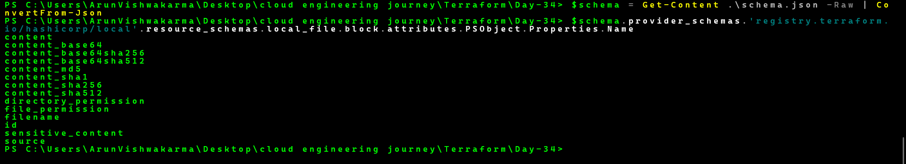
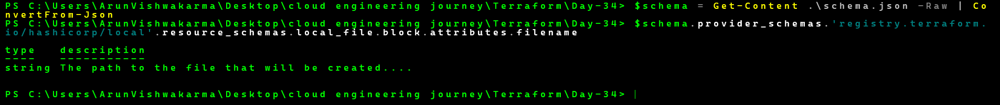
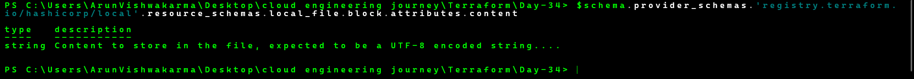
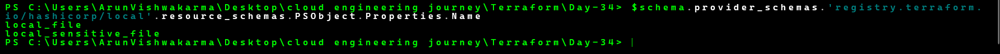
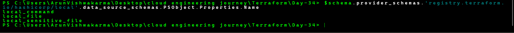
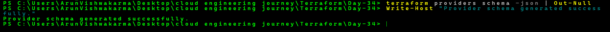
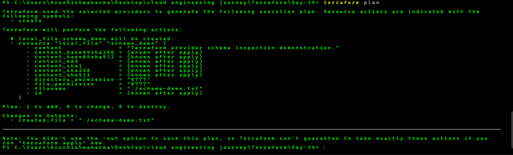
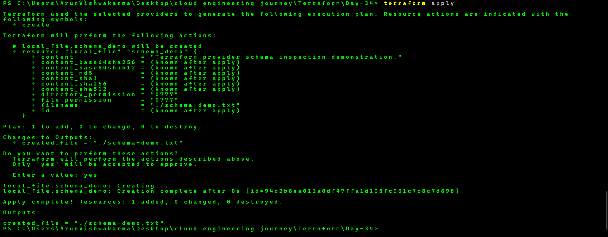
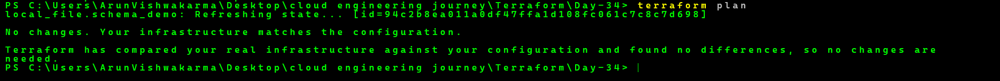

# Day 34 - Terraform Provider Schema Inspection

## Practical Summary

In this practical, I learned how to inspect the schema of a Terraform provider using the `terraform providers schema` command.

The Terraform Local provider schema was generated in JSON format and inspected to understand the resources, data sources, and attributes supported by the provider.

The `local_file` resource schema was also inspected to understand attributes such as `filename` and `content`, including their data types and configuration details.

After inspecting the provider schema, a Terraform resource was created and verified successfully.

---

## Provider Schema Inspection

Terraform providers define schemas that describe the resources, data sources, attributes, data types, and configuration rules supported by the provider.

The provider schema was exported into a JSON file using:

```text
terraform providers schema -json > schema.json
```

The generated schema was then inspected using PowerShell.

---

## Local File Resource Schema

The `local_file` resource from the Local provider was inspected.

Important attributes included:

- `filename`
- `content`
- `content_base64`
- `file_permission`
- `directory_permission`
- `source`
- `id`

The `filename` attribute uses the `string` data type and defines the path of the file that Terraform creates.

The `content` attribute also uses the `string` data type and defines the content stored in the file.

---

## Provider Resources

The provider schema was used to inspect the resources available in the Local provider.

This helped understand how Terraform exposes different resources through a provider schema.

---

## Provider Data Sources

The available data sources in the Local provider were also inspected.

This demonstrated that provider schemas contain information about both resources and data sources.

---

## Schema Validation

The provider schema was successfully generated again using:

```text
terraform providers schema -json
```

This confirmed that Terraform could successfully access the installed provider schema.

---

## Terraform Resource Deployment

After the schema inspection, the `local_file.schema_demo` resource was applied successfully.

The resource created:

```text
schema-demo.txt
```

The file contained:

```text
Day 34 - Terraform Provider Schema Inspection.
```

---

## Final Terraform Verification

A final `terraform plan` was executed after the resource was created.

Terraform reported that there were no pending infrastructure changes.

This confirmed that the Terraform configuration and current state were synchronized.

---

## Screenshots

### 1. Local File Resource Schema



### 2. Filename Attribute Schema



### 3. Content Attribute Schema



### 4. Provider Resources



### 5. Provider Data Sources



### 6. Schema Validation



### 7. Final Terraform Plan



### 8. Terraform Apply



### 9. Final Resource Result


### 10. Final No Changes



---

## What I Learned

- Terraform provider schemas
- `terraform providers schema`
- Provider schema JSON
- Resource schema inspection
- Resource attributes
- Attribute data types
- Provider resources
- Provider data sources
- Schema validation
- Terraform resource verification
- Final Terraform plan verification

---

## Final Result

The Terraform provider schema was successfully generated and inspected.

The `local_file` resource schema and its attributes were examined, provider resources and data sources were identified, and a Terraform-managed file was successfully created and verified.

The final Terraform plan confirmed:

```text
No changes. Your infrastructure matches the configuration.
```