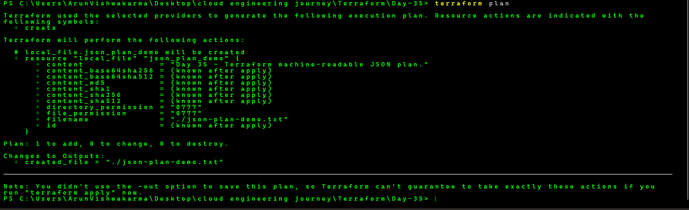
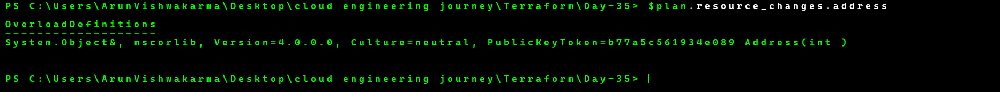
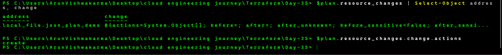
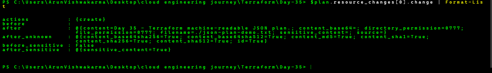
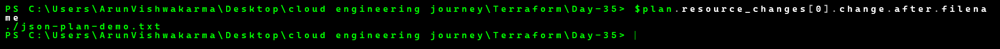
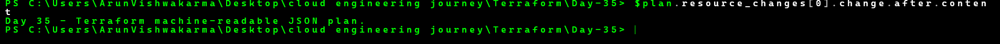
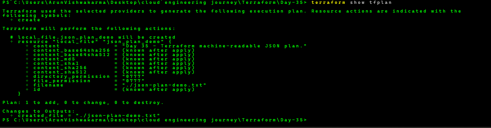
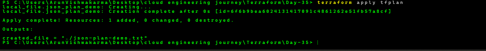

# Day 35 - Terraform Machine-Readable JSON Plan

## Practical Summary

In this practical, Terraform's machine-readable JSON plan was explored.

A Terraform plan was generated and the planned resource information was inspected using Terraform's JSON plan output.

The saved Terraform plan was converted into JSON format using `terraform show -json`. The generated JSON data was then loaded into PowerShell and specific Terraform plan information was extracted programmatically.

The practical inspected:

- Planned resource address
- Planned action
- Resource change details
- Planned filename
- Planned file content

The saved Terraform plan was also displayed in human-readable format and then successfully applied.

---

## Practical Workflow

```text
Terraform Configuration
        ↓
terraform plan
        ↓
Saved Terraform Plan
        ↓
terraform show -json
        ↓
tfplan.json
        ↓
PowerShell JSON Inspection
        ↓
Resource / Action / Attributes
        ↓
terraform show tfplan
        ↓
terraform apply tfplan
```

---

## Resource Used

The practical used the Terraform `local_file` resource:

```text
local_file.json_plan_demo
```

The resource creates:

```text
json-plan-demo.txt
```

with the content:

```text
Day 35 - Terraform machine-readable JSON plan.
```

---

## JSON Plan Inspection

The generated JSON plan was loaded into PowerShell and used to inspect Terraform's planned resource information.

The following information was successfully retrieved:

```text
Resource Address:
local_file.json_plan_demo

Planned Action:
create

Planned Filename:
./json-plan-demo.txt

Planned Content:
Day 35 - Terraform machine-readable JSON plan.
```

---

## Human-Readable Plan

The saved Terraform plan was displayed in human-readable format using Terraform to verify the planned resource before applying it.

---

## Applying the Saved Plan

The saved Terraform plan was successfully applied using the `tfplan` file.

The `local_file.json_plan_demo` resource was created successfully.

---

## Screenshots

### Screenshot 1 - Initial Terraform Plan



### Screenshot 2 - JSON Resource Change



### Screenshot 3 - JSON Planned Action



### Screenshot 4 - JSON Change Details



### Screenshot 5 - JSON Planned Filename



### Screenshot 6 - JSON Planned Content



### Screenshot 7 - Human-Readable Terraform Plan



### Screenshot 8 - Saved Plan Applied



---

## Final Result

The Terraform configuration was successfully planned and applied.

The machine-readable JSON plan was generated and inspected successfully.

Resource information and planned attributes were retrieved programmatically from the JSON plan.

The saved Terraform plan was successfully applied, and the Terraform-managed file was created.

Final verification confirmed that the infrastructure matched the Terraform configuration with no pending changes.